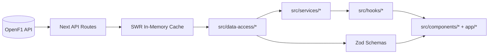

# Data Flow

## Reliability Contract

- All client-side API calls go through `src/data-access/http.ts`.
- Every request has a timeout, retry policy, and degraded fallback path.
- Responses are validated with Zod schemas before entering UI state.
- UI receives health status as one of:
  - `healthy`
  - `degraded`
  - `offline`

## Server Cache Contract

- `app/api/sessions` and `app/api/telemetry` use stale-while-revalidate caches.
- `app/api/replay/[year]/[round]` serves stale replay payloads while background refresh runs.
- If upstream data fails, stale cache is returned when available.
